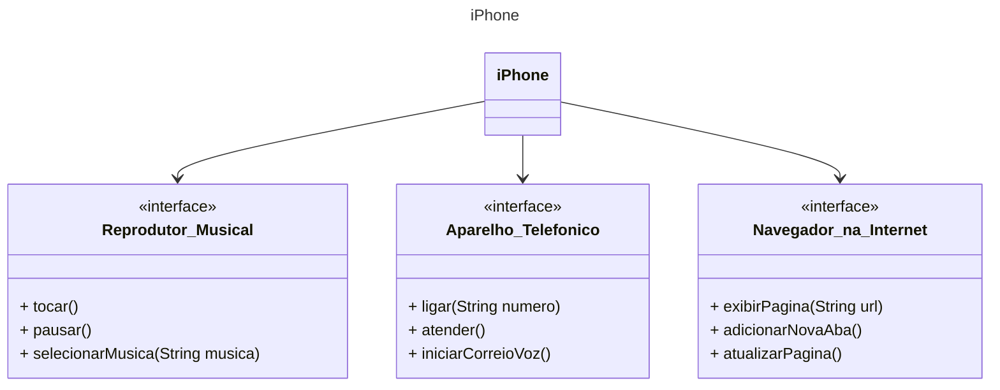

# DIO - Trilha Java Básico

## Autor  
🔸[wprotheus](https://github.com/wprotheus)
  
## POO - Desafio  

### Modelagem e Diagramação de um Componente iPhone  

Neste desafio serei responsável por modelar e diagramar a representação UML do componente iPhone, abrangendo suas funcionalidades definidas/escolhidas.  

#### Funcionalidades a modelar
1. **Reprodutor Musical**
   - Métodos: `tocar()`, `pausar()`, `selecionarMusica(String musica)`
2. **Aparelho Telefônico**
   - Métodos: `ligar(String numero)`, `atender()`, `iniciarCorreioVoz()`
3. **Navegador na Internet**
   - Métodos: `exibirPagina(String url)`, `adicionarNovaAba()`, `atualizarPagina()`

### Objetivo  
1. Criado o diagrama UML que representa as funcionalidades descritas acima.  

### Diagrama UML

2. Implementada as classes e interfaces correspondentes em Java.
